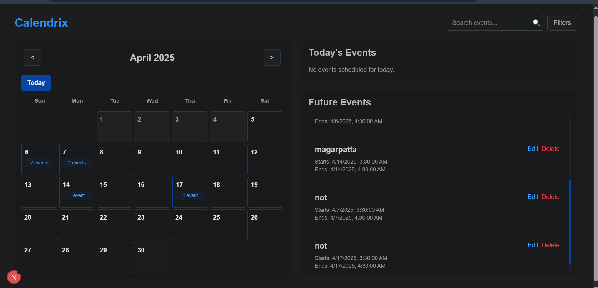

# Calendrix - Modern Event Calendar Application

Calendrix is a full-stack event calendar application that allows users to schedule and manage events with notifications.



## Features

- **Interactive Calendar**: Monthly view with event indicators
- **Event Management**: Create, edit, and delete events
- **Media Support**: Attach images and videos (YouTube or direct upload)
- **Browser Notifications**: Get reminders when events are about to start
- **Search & Filtering**: Find events by title/description and filter by date range
- **Modern UI**: Clean, responsive design built with Tailwind CSS

## Tech Stack

### Frontend
- **Next.js**
- **TypeScript**
- **Tailwind CSS**

### Backend
- **NestJS**
- **TypeScript**
- **Swagger**: API documentation

## Getting Started

### Prerequisites

- Node.js (v14+ recommended)
- npm or yarn

### Installation & Setup

1. Clone the repository
   ```bash
   git clone https://github.com/Harshit-65/calendrix.git
   cd calendrix
   ```

2. Set up the backend
   ```bash
   cd backend/api
   npm install
   ```

3. Set up the frontend
   ```bash
   cd ../../frontend
   npm install
   ```

### Running the Application

1. Start the backend server
   ```bash
   cd backend/api
   npm run start:dev
   ```
   The API will be available at http://localhost:3000

2. Start the frontend development server
   ```bash
   cd frontend
   npm run dev
   ```
   The app will be available at http://localhost:3001

## API Documentation

The API documentation is available through Swagger UI at http://localhost:3000/api when the backend is running.

## Project Structure

```
calendrix/
├── backend/            # NestJS backend
│   └── api/
│       ├── src/        # Source code
│       └── uploads/    # Uploaded files storage
│
└── frontend/           # Next.js frontend
    ├── public/         # Static assets
    └── src/            # Source code
        ├── app/        # Next.js app directory
        ├── components/ # React components
        └── services/   # API services
```

## Features in Detail

### Event Management
- Create events with title, description, start/end times
- Edit existing events
- Delete events
- View event details including attached media

### Notifications
- Browser notifications for upcoming events
- Snooze option for notifications
- Permission request handling

### Media Handling
- Image upload (up to 5MB)
- Video upload (up to 20MB) 
- YouTube video linking

### Search & Filtering
- Search by title or description
- Filter by date range
- Sort by various fields (start time, end time, creation date, title)
- Ascending or descending order options


